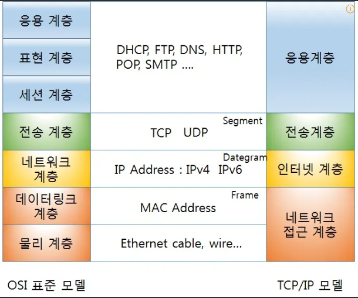
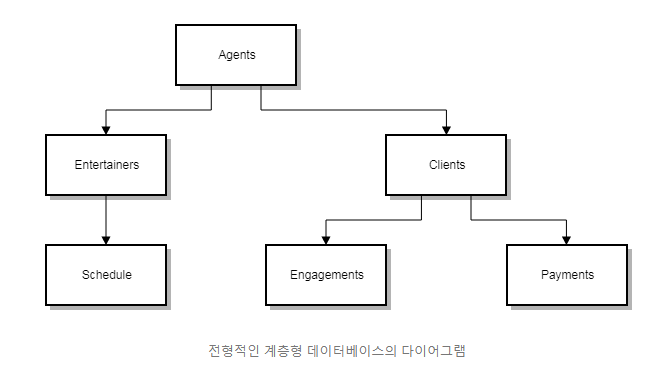

오전 10:22 2026-04-24

>- OSI 7 Layer
>- 라우팅 프로토콜
>- 데이터베이스의 종류와 설명

#### OSI 7 Layer

국제표준화기구에서 개발한 모델, 컴퓨터 네트워크 프로토콜 디자인과 통신을 계층으로 나누어 설명한 것

1. 물리
실제 장비들은 연결하기 위한 장치
ex) 허브, 리피터

2. 데이터 링크
송수신되는 정보의 오류와 흐름을 관리하여 안정한 정보 전달을 수행을 도우는 역할
ex) 브릿지, 스위치

3. 네트워크
데이터를 목적지까지 안전하고 빠르게 전달
ex) 라우터

4. 전송
End to End의 사용자들이 신뢰성있는 데이터를 주고 받을 수 있게 하는 역할, 패킷 생성&전송
ex) TCP(신뢰성, 연결지향적), UDP(비신뢰성, 비연결성, 실시간)

5. 세션
데이터가 통신하기 위한 논리적인 연결, 
end to end의 응용 프로세스가 통신을 관리하기 위한 방법 제공(deplex, half-duplex, full duplex)
ex) API, Socket

6. 표현
데이터 표현이 상이한 응용 프로세스의 독립성을 제공하고 암호화
ex) 파일 확장자

7. 응용
응용 프로세스와 직접 관계하여 일반적인 응용 서비스를 수행
ex) HTTP, FTP, SMTP, POP3, IMAP, Telnet (프로토콜)

#### 데이터베이스의 종류와 설명

- 계층 형

폴더와 파일 등의 계층 구조로 데이터를 저장하는 방식
트리 형태로 부모/자식으로 표현되고 
부모 테이블은 하나 이상의 자식 테이블과 관계를 맺을 수 있고,
 자식 테이블은 오직 하나의 부모 테이블에 한해 관계를 맺을 수 있다.

	- 장점)
데이터 접근 속도가 빠름, 데이터 사용량 쉽계 예측 가능

	- 단점)
상하 종속적인 관계로 구성되어 초기 세팅 후 프로세스 수용이 어려움

---

- 네트워크 형
데이터 구조를 네트워크 상의 노드 형태로 논리적이게 표현한 데이터 모델

- 관계 형
행과 열을 가지는 표 형식 데이터를 저장하는 데이터 모델

- 객체지향 형
객체 그대로 DB에 저장하는 데이터 모델

